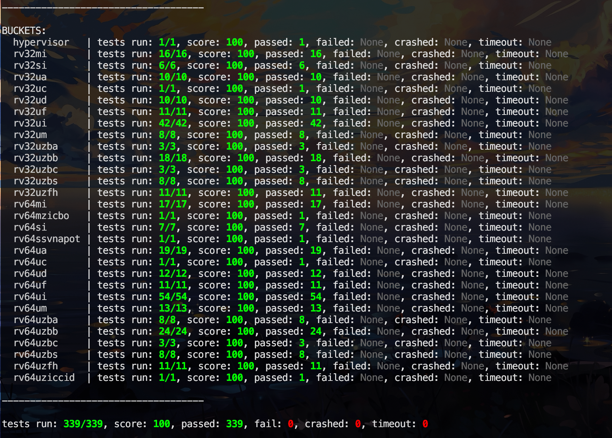
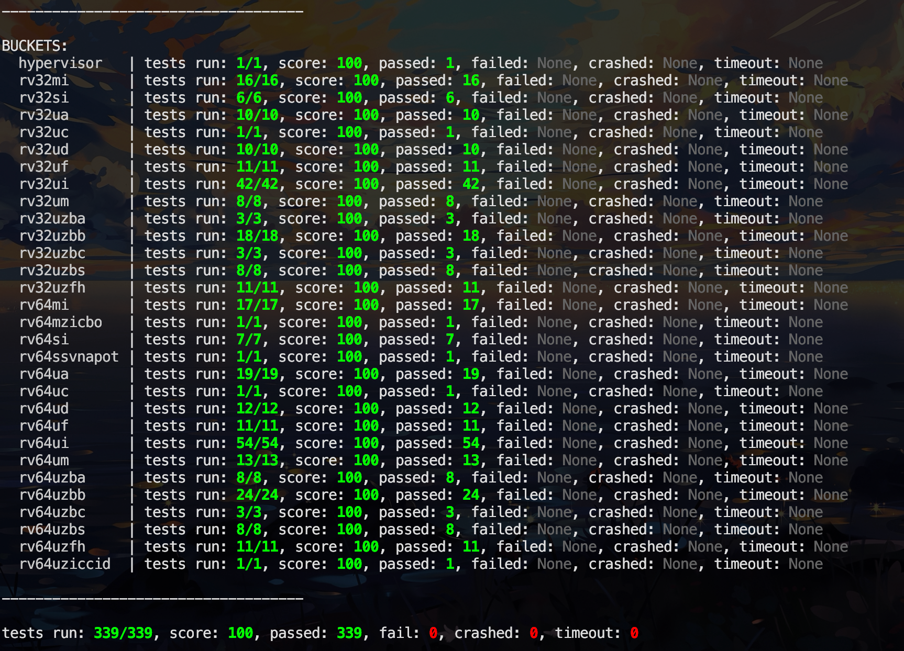
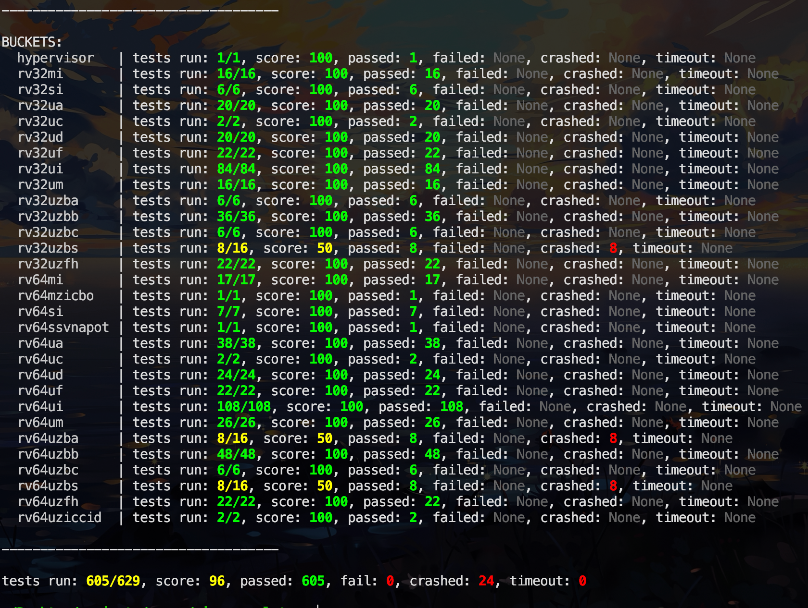

# RISC-V Emulator

A high-performance RISC-V RV64GC emulator written in Rust, achieving **580 million instructions per second** on modern hardware.



## Performance

This emulator was built with speed as the primary goal, utilizing advanced techniques to maximize throughput:

- **580+ MIPS** on Apple M2-series silicon
- Instruction caching with page-based translation
- Optimized hot paths with cold path separation
- Minimal branch overhead in the execution loop

Read the full story: [Speedrunning a CPU](https://daymare.net/blogs/speedrunning-a-cpu)

## Features

- **RV64GC ISA support**: Integer, Multiply/Divide, Float
- **Sv39 virtual memory** with full page table walk
- **HTIF interface** for test harness communication
- **M/S/U privilege modes** with proper trap delegation
- **CLINT** timer and interrupt support

## Test Results





## Building

```bash
# Standard build
cargo build --release

# With test harness support
cargo build --release --features test-harness
```

## Running Tests

```bash
# Run a single test
./target/release/riscv-emulator riscv-tests/isa/rv64ui-v-add.bin

# Run full test suite
SESAME="testfilter v;timeout 0" ./target/release/riscv-emulator ./riscv-tests/isa/
```

## Architecture

```
src/
├── lib.rs      # Core emulator loop, instruction execution, CSRs
├── main.rs     # CLI, ELF/binary loading, test harness
├── mem.rs      # Physical memory, MMIO
├── instrs.rs   # Instruction cache, decoding
└── utils.rs    # Bit manipulation helpers
```
